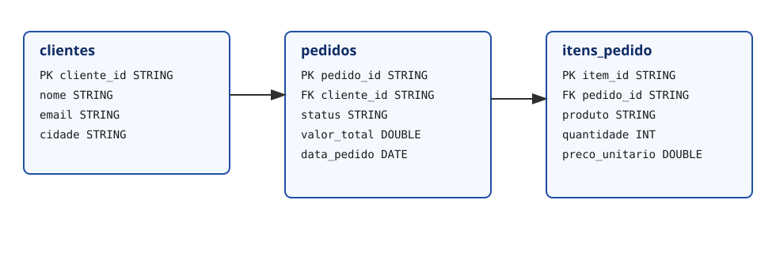

# Contextualização do Trabalho

Este projeto implementa um único ambiente de estudo com **Apache Spark (PySpark)**, **Delta Lake** e **Apache Iceberg**.

## Cenário das tabelas

A fonte de dados escolhida é o conjunto de vendas de e-commerce (inspirado no [Olist Brazilian E-Commerce Dataset](https://www.kaggle.com/datasets/olistbr/brazilian-ecommerce)).

As tabelas do cenário são:

- `clientes`
- `pedidos`
- `itens_pedido`

## Modelo ER

## Objetivo técnico

Demonstrar no Spark SQL operações de:

- `INSERT`
- `UPDATE`
- `DELETE`

em duas tecnologias de tabela:

- **Delta Lake**
- **Apache Iceberg**

## Notebooks do projeto

- `notebooks/cenario_modelagem.ipynb`
- `notebooks/delta_lake_demo.ipynb`
- `notebooks/iceberg_demo.ipynb`
